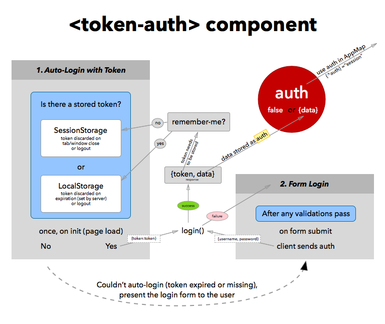

# auth-component
A Collection of Authentication Tools for DoneJS.

## The `<token-auth>` component

The `token-auth` component makes it easy to implement JWT-based authentication for your application.

```mustache
<token-auth {^auth}="session"
    key-location="authToken"
    login-endpoint="http://localhost:8080/login"
    username-field="email"
    {(loading)}="loading"
    remember-me >
</token-auth>
```
Available attributes include
 * `key-location` - The name of the location where the token will be stored in either SessionStorage or LocalStorage.
 * `login-endpoint` - The url used to POST login data.
 * `username-field` - used customize what parameter is sent to the server. default is `username`. 
 * `remember-me` - Determines the longevity of the stored token. If enabled, the token will be stored in LocalStorage instead of SessionStorage.

The `token-auth` component includes a loading indicator and a basic login form that overlay your application.  Future improvements will allow you to customize the template.




## The `<session-auth>` component
Coming in a future release.

## Which type of authentication should I use?
JWT auth, when executed correctly, is superior to cookie/session auth in a couple of potentially big ways:
 - It's more secure.  Due to the way that browsers were designed to handle cookies, they are vulnerable to XSS attacks.  By not using cookies, these cookie-based attacks can be avoided.
 - It's more efficient.  Many cookie/session auth implementations require more communication with a database server to retrieve user data for the verification process.  JWT tokens store that data inside the encrypted token, which eliminates the extra round trip to the database.

One caveat to using token auth is that DoneJS's server-side rendering will not have access to the token.  This limits the server-side rendered parts of your app to information that is publicly available.  Your templates will still be able to be rendered on the server.  Any user-specific data will need to be requested by the browser.

## Security
This information isn't a comprehensive guide to security, but hopefully can be helpful in helping you to secure your application. If is other information that you think should be included here, please open an issue or submit a PR.

If you see room for improvement in any of the provided modules, whether in features or in security improvements, please help out the community by opening issues or submitting a PR.